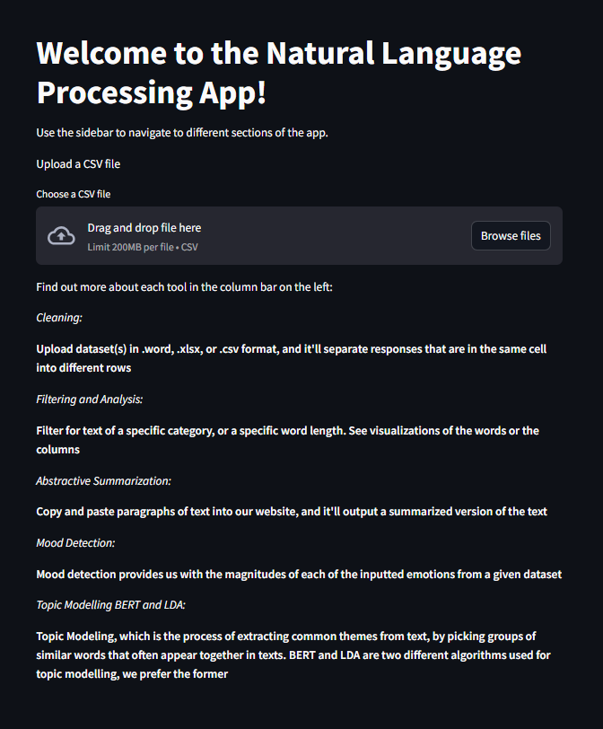
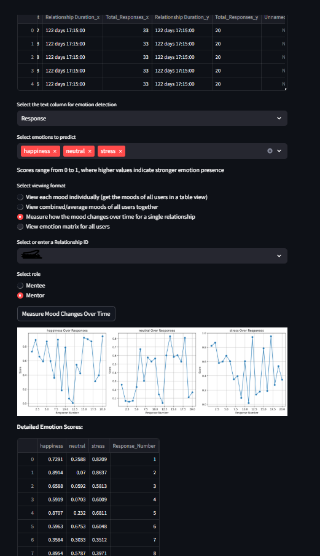

[CLICK HERE: https://nlp-tool.streamlit.app/](https://nlp-tool.streamlit.app/)

This tool can be used by users in non-tech domains to experiment with natural language processing tools for text analysis. Upload any dataset with a text column. 

<!-- [![Contributors][contributors-shield]][contributors-url]
[![Forks][forks-shield]][forks-url]
[![Stargazers][stars-shield]][stars-url]
[![Issues][issues-shield]][issues-url]

 -->

Mood detection demo:
